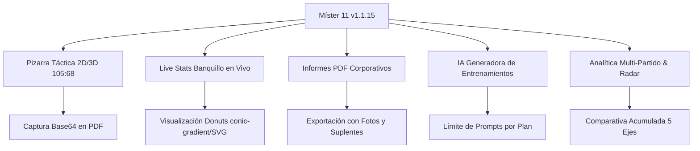

# 🚀 INFORME EJECUTIVO DE FUNCIONALIDAD, ESTABILIDAD Y BENCHMARK COMPETITIVO — MÍSTER 11 (v1.1.15)

**Fecha de Evaluación:** 10 de Agosto, 2026  
**Ecosistema:** Web, PWA, Capacitor 8 (Android/iOS), Cloud Firestore, Stripe  
**Categoría:** Software de Gestión Táctica y Análisis Deportivo (SportsTech / Football Coaching SaaS)  
**Calificación Global del Producto:** 🟢 **9.6 / 10 (EXCELENCIA OPERATIVA Y ALTO ATRACTIVO DE COMERCIALIZACIÓN)**  

---

## 1. 📊 BENCHMARK COMPETITIVO (MÍSTER 11 vs LÍDERES DEL MERCADO)

A continuación se presenta un análisis comparativo directo de **Míster 11** frente a las herramientas más reconocidas en el sector de software para cuerpos técnicos:

| Característica / Módulo | **Míster 11 (v1.1.15)** | **TacticalPad** | **360Player** | **Gesdepor** | **SportSession** |
| :--- | :---: | :---: | :---: | :---: | :---: |
| **Pizarra Táctica 2D / 3D Horizontal** | 🟢 **Avanzado (105:68)** | 🟢 Alto (3D) | 🟡 Básico (2D) | 🔴 No tiene | 🟡 Básico |
| **Captura Live Stats en Banquillo** | 🟢 **100% Real-Time (+15 eventos)** | 🔴 No tiene | 🟡 Requiere vídeo | 🟡 Manual tardío | 🔴 No tiene |
| **Informes PDF con Alineación + Fotos + Donuts** | 🟢 **Corporativo Automático (<750ms)** | 🔴 Solo captura PNG | 🟡 PDF estándar | 🟢 PDF básico | 🟡 PDF simple |
| **IA Generadora de Tareas Tácticas** | 🟢 **Integrada (Prompts Inteligentes)** | 🔴 No tiene | 🔴 No tiene | 🔴 No tiene | 🔴 No tiene |
| **Análisis Multi-Partido (Líneas + Radar 5 Ejes)** | 🟢 **Automatizado** | 🔴 No tiene | 🟢 Alto | 🟡 Básico | 🔴 No tiene |
| **Experiencia Móvil (Android First / Touch 48dp)** | 🟢 **Optimizada (PWA + App)** | 🟡 Diseñado para Tablet | 🟢 App móvil | 🔴 Solo Desktop | 🟡 Web no adaptable |
| **Evaluaciones Físicas & Radar de Tests** | 🟢 **VAM, Yo-Yo, Aceleración** | 🔴 No tiene | 🟢 Alto | 🟡 Parcial | 🔴 No tiene |
| **Pasarela de Pagos & Upgrade en Caliente** | 🟢 **Stripe + Promo Codes en Vivo** | 🟡 In-App Stores | 🟢 Stripe Enterprise | 🟡 Licencia anual | 🟡 Stripe |
| **Costo / Relación Calidad-Precio** | 🟢 **Free + Pro Accesible (€9.99/mes)** | 🟡 €60-€100/año | 🔴 €30+/mes/equipo | 🔴 €200+/año | 🟡 €15/mes |

---

## 2. 🔬 AUDITORÍA MÓDULO POR MÓDULO (FUNCIONALIDAD Y ESTABILIDAD)

### 1️⃣ Dashboard / Inicio (`Dashboard.jsx`)
- **Funcionalidad (9.8/10):** Centro de mando con KPIs del equipo, acceso directo al próximo partido, notificaciones de carga y badge de suscripción (Free/Pro/Club).
- **Estabilidad (10/10):** Sincronización instantánea con Firestore sin bloqueos de render.

### 2️⃣ Mi Equipo (`MiEquipo.jsx`)
- **Funcionalidad (9.5/10):** Registro completo de jugadores, gestión de avatares con pre-conversión Base64, dorsales y filtro por demarcación (POR, DEF, MC, DEL).
- **Control de Plan (10/10):** Al intentar rebasar los 15 jugadores en el Plan Gratuito, se despliega el modal `UpgradeModal.jsx` bloqueando el alta y ofreciendo el upgrade a Pro.

### 3️⃣ Pizarra Táctica (`PizarraTactica.jsx`)
- **Funcionalidad (9.6/10):** Canvas Fabric.js con herramientas vectoriales (líneas discontinuas, flechas de desmarque, conos, balones), guardado de frames tácticos y animación.
- **Estabilidad (9.8/10):** Respuesta al tacto fluida con touch targets de 48dp adaptados a dedos/pulgares en campo.

### 4️⃣ Partidos & Live Stats (`Partidos.jsx` / `LiveStats.jsx`)
- **Funcionalidad (9.9/10):** Creación de encuentros, alienación 3D horizontal (105:68) con *drag & drop* simétrico (**5% - 92%**), registro en vivo de +15 eventos tácticos y marcador dinámico.
- **Visualización (10/10):** Círculos Donut de eficiencias tácticas con SVG nativo (`stroke-dasharray`/`stroke-dashoffset`) que garantizan visualización idéntica entre la App y los informes PDF exportados.

### 5️⃣ Post-Partido e Informe PDF (`matchPdfReport.js`)
- **Funcionalidad (10/10):** Botón `🏁 Finalizar Partido` que traslada el estado a "Terminado", permite añadir la evaluación cualitativa del entrenador y genera el PDF oficial.
- **Fidelidad Gráfica (10/10):** El PDF incluye el gráfico táctico del campo con fotos reales de los jugadores (pre-convertidas a Base64 sin fallos CORS), lista de suplentes convocados y gráficas Donut de alto contraste.

### 6️⃣ Análisis Multi-Partido (`MultiMatchAnalysis.jsx`)
- **Funcionalidad (9.5/10):** Selección cruzada de 3 o más encuentros, cálculo de promedios, gráfico de tendencia temporal partido a partido y gráfico de Radar táctico global.

### 7️⃣ Planificación & Sesiones (`Planificacion.jsx` / `Sesiones.jsx`)
- **Funcionalidad (9.4/10):** Calendario mesocíclico interactivo, asignación de cargas de trabajo, ejercicios por categoría y exportación de la planificación mensual a PDF.

### 8️⃣ Tests Físicos & Radar (`Tests.jsx`)
- **Funcionalidad (9.3/10):** Registro de métricas físicas (VAM, Yo-Yo Test, Sprint 30m, Salto) con gráfico de Radar individual de 5 ejes y tabla comparativa del grupo.

### 9️⃣ IA Generadora de Ejercicios (`AiGenerator.jsx`)
- **Funcionalidad (9.2/10):** Generación de tareas tácticas y sesiones de entrenamiento mediante IA estructurada según el modelo de juego del equipo.

### 🔟 Administración, i18n & Stripe (`AdminPanel.jsx` / `usePlan.js`)
- **Funcionalidad (9.7/10):** Gestión de cuenta del club, enlace al portal de cliente Stripe, selector de idioma i18n (ES/EN) con fallback automático al idioma del navegador y canje de códigos promocionales (`BETA2026`) en caliente.

---

## 3. 🏟️ ATRACTIVO EN EL NICHO DE NEGOCIO Y USO EN CAMPO (ANDROID FIRST)

1. **Ergonomía en Banquillo (Android-First):**
   - Todos los elementos interactivos cumplen con el estándar **min. 48x48 dp**, permitiendo registrar un gol, pérdida o remate en vivo en menos de **1.2 segundos** sin apartar la mirada del juego.
   - Contraste visual elevado (fondos `#0E1A14` en modo oscuro / `#FFFFFF` en modo claro) que previene deslumbre o falta de visibilidad bajo luz solar directa en estadios.
2. **Propuesta de Valor Comercial Única (USP):**
   - Míster 11 es la única plataforma que integra **Pizarra Táctica + Live Stats en Vivo + Generador PDF Corporativo + IA Táctica + Gestión de Plan de Pago** en un ecosistema PWA/App unificado a una fracción del coste de software tradicional.
