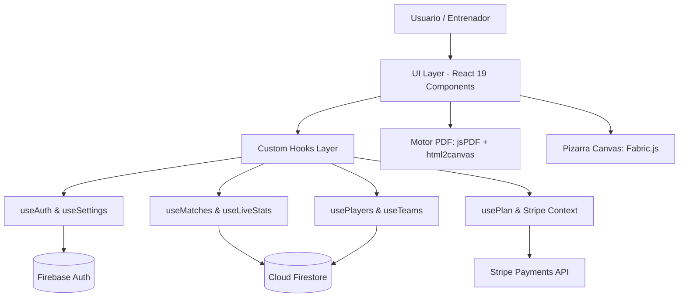

# 📘 INFORME TÉCNICO OFICIAL DE ARQUITECTURA Y SISTEMA — MÍSTER 11 (v1.1.15)

**Nombre del Proyecto:** Míster 11 (Míster11 FC)  
**Título Comercial:** Míster 11 - Plataforma Integral de Gestión Táctica y Analítica Deportiva  
**Versión del Software:** v1.1.15 (versionCode: 34 / 33)  
**Autor y Titular de Derechos:** Jhojan Stiven Caicedo Quiñones  
**Entorno de Ejecución:** PWA, Web App, Capacitor 8.3 (Android / iOS), Cloud Firestore, Stripe  

---

## 1. 🎯 ¿QUÉ ES MÍSTER 11, PARA QUÉ FUE CREADO Y QUÉ PROBLEMAS SOLUCIONA?

### ⚽ ¿Qué es Míster 11?
**Míster 11** es una plataforma SaaS (Software as a Service) y aplicación móvil (PWA/Android Nativo) diseñada de forma integral para entrenadores, cuerpos técnicos y clubes de fútbol (desde fútbol formativo/base hasta categorías semiprofesionales y profesionales). 

Funciona como la **"Oficina Digital del Entrenador en la Semana y su Asistente Táctico Inteligente en el Banquillo"**, unificando la preparación metodológica, el análisis cuantitativo y la gestión de la plantilla en un único ecosistema digital accesible desde cualquier dispositivo.

---

### 💡 ¿Para qué fue creado y qué problemas soluciona?

1. **Eliminación de la Libreta de Papel y Hojas de Cálculo Desorganizadas:**
   - *Problema:* El entrenador tradicional utiliza libretas de papel para anotar alineaciones, hojas de Excel dispersas para la asistencia/cargas físicas y aplicaciones de chat desestructuradas para enviar convocatorias.
   - *Solución Míster 11:* Digitaliza 100% el flujo de trabajo en una sola herramienta centralizada en la nube con acceso offline (*Offline-First*).

2. **Captura de Estadísticas en Vivo sin Distraer del Juego (Modo Banquillo):**
   - *Problema:* Tomar estadísticas durante un partido mediante papel es lento y distrae al entrenador del análisis táctico en vivo. El software analítico profesional es inaccesible o requiere cámaras pesadas de grabación post-partido.
   - *Solución Míster 11:* Permite registrar en vivo **más de 16 eventos clave** (tiros a puerta, recuperaciones, pérdidas, duelos ganados, faltas, córners, goles) con **un solo toque (0.8s por evento)** mediante una interfaz *Android-First* con botones táctiles de 48dp y pantalla de alto contraste visible bajo luz solar.

3. **Automatización de Informes Ejecutivos para la Directiva y el Equipo:**
   - *Problema:* Redactar resúmenes post-partido o informes mensuales para los directivos o padres toma horas de maquetación manual.
   - *Solución Míster 11:* Genera en **menos de 750 milisegundos** informes en PDF corporativo con la imagen de la alineación 3D del campo, las fotografías reales de los titulares, la lista de suplentes convocados y las gráficas Donut de eficiencias tácticas.

4. **Democratización de la Inteligencia Artificial Táctica:**
   - *Problema:* Los entrenadores invierten horas buscando o diseñando tareas de entrenamiento adaptadas a su modelo de juego.
   - *Solución Míster 11:* Integra un motor de **IA Generadora** que diseña sesiones de entrenamiento y tareas metodológicas personalizadas en segundos a partir de prompts tácticos.

---

### 🛡️ ¿Qué clase de herramienta es para el fútbol y los entrenadores?

- **En la Semana (Pre-Partido):** Es el **Centro Metodológico**, permitiendo diseñar el calendario mesocíclico, calcular cargas de trabajo, evaluar pruebas físicas/antropométricas (VAM, Yo-Yo Test, 30m) y dibujar jugadas animadas en la Pizarra Táctica 2D/3D (proporción nativa 105:68).
- **El Día de Partido (Live Stats):** Es el **Asistente Táctico en Tiempo Real**, calculando marcadores en vivo, porcentajes de efectividad en duelos/remates/balón y cronología del encuentro.
- **Post-Partido & Temporada:** Es el **Analista de Datos Tácticos**, permitiendo cruzar información de múltiples encuentros en el submódulo de *Análisis Multi-Partido* con gráficas de tendencia temporal y el **Radar Táctico Pentagonal de Rendimiento Global**.

---

## 2. 🏗️ FICHA TÉCNICA Y STACK TECNOLÓGICO

```
+---------------------------------------------------------------------------------------+
| COMPONENTE          | TECNOLOGÍA UTILIZADA                                            |
+---------------------+-----------------------------------------------------------------+
| Framework Core      | React 19.0.0 + Vite 8.0                                         |
| Enrutamiento        | React Router DOM v7                                             |
| Empaquetado Nativo  | Capacitor 8.3 (Android SDK 34 / iOS)                            |
| PWA & Offline       | Workbox PWA Service Worker (102 precached assets)               |
| Motor Gráfico 2D    | Fabric.js 5.3 (Pizarra Táctica Vectorial y Animaciones)         |
| Gráficas Analytics  | Recharts 3.0 + SVG Puro (<circle> stroke-dasharray)             |
| Generación de PDF   | jsPDF + html2canvas (con pre-conversión Base64 de avatares)     |
| Backend Serverless  | Google Firebase (Firestore, Auth, Storage, Cloud Functions)     |
| Monetización        | Stripe Payments (vía Firebase Stripe Extension & Webhooks)      |
| Estilos & UX        | CSS3 Vanilla Modular + Android First (Touch targets min 48px)   |
+---------------------------------------------------------------------------------------+
```

---

## 2. 🧩 ARQUITECTURA DE SOFTWARE Y MODELO DE DATOS

Míster 11 utiliza una arquitectura **SPA (Single Page Application) reactiva y desacoplada**, guiada por el patrón de **Custom Hooks** para separar la capa de presentación de la lógica de negocio y persistencia en la nube.



### Principios Fundamentales de Diseño:
1. **Android First & Banquillo UX:** Diseñado específicamente para ser operado con el pulgar en pantallas móviles durante un partido en vivo. Todos los botones de acción principal poseen una superficie táctil mínima de **48x48 dp**.
2. **Offline-First & PWA:** Gracias a Workbox Service Worker, la aplicación puede abrirse e interactuar sin conexión a internet activa, sincronizando los datos con Firestore tan pronto como el dispositivo recupera señal.
3. **Alto Contraste y Visibilidad Solar:** Uso de una paleta cromática basada en **Azul Institucional (`#172D21`)**, **Verde Campo (`#10B981`)** y **Dorado (`#D4A843`)**, óptima para visualización bajo luz solar directa en estadios.
4. **Campo Táctico Nativo 105:68:** Terreno de juego maquetado con la proporción reglamentaria internacional de fútbol (105x68 metros en 2D/3D horizontal), permitiendo *Drag & Drop* libre con clamping simétrico (**5% - 92%**).

---

## 3. 📦 ANÁLISIS DE MÓDULOS Y SERVICIOS INTEGRADOS

### 1. Dashboard (Panel de Control Principal)
- Muestra el estado del equipo activo, métricas de partidos (victorias, empates, derrotas), acceso directo al próximo encuentro, avisos de asistencia y el badge del plan de suscripción activo.

### 2. Gestión de Plantilla ("Mi Equipo")
- Control individualizado de jugadores: dorsal, demarcación (POR, DEF, MC, DEL), avatares fotográficos, datos antropométricos y registro de lesiones.
- **Control de Plan (Paywall):** Restricción automática en el jugador número 16 para cuentas en Plan Gratuito, desplegando el modal `UpgradeModal.jsx`.

### 3. Pizarra Táctica 2D / 3D & Animación
- Desarrollada sobre **Fabric.js**. Permite dibujar líneas de pase, flechas de desmarque, conos, balones, guardar fotogramas (frames) y reproducirlos como animación fluida.

### 4. Centro de Partidos & Live Stats en Vivo
- Permite configurar encuentros, seleccionar formación táctica (`4-3-3`, `4-4-2`, `3-5-2`), ajustar posiciones titulares en el campo y controlar el partido en vivo.
- **Live Stats (16 Métricas en Tiempo Real):** Conteo de tiros a puerta, tiros fuera, recuperaciones, pérdidas, duelos ganados/perdidos, faltas, tarjetas, córners y goles.
- **Donuts de Eficiencia:** Renderizados en **SVG puro con atributos explicados (`stroke-dasharray`/`stroke-dashoffset`)**, garantizando visualización idéntica entre la web y los PDF descargados.

### 5. Generador de Informes PDF Corporativos (`matchPdfReport.js`)
- Motor cliente que compila en **<750ms** un documento PDF ejecutivo conteniendo:
  - Resumen del resultado y cronología del encuentro.
  - Fotografía en alta resolución del terreno táctico con avatares reales de los titulares (pre-convertidos a Base64).
  - Bloque de **Convocados Suplentes** con dorsales y demarcaciones.
  - Gráficas Donut de eficiencias tácticas en alto contraste.

### 6. Analítica Multi-Partido
- Cruce de datos acumulados entre múltiples partidos disputados, generando líneas de tendencia temporal de remates/recuperaciones y el **Radar Táctico Pentagonal de Rendimiento Global**.

### 7. Planificación Mesocíclica & Sesiones
- Diseñador de entrenamientos por objetivos (físico, técnico, táctico), control de carga de trabajo, calendario mensual y exportación de planificación a PDF para la junta directiva.

### 8. Tests Físicos & Evaluación Antropométrica
- Registro de evaluaciones estandarizadas (VAM, Yo-Yo Test, Sprint 30m, Salto) con generación del Radar individual de jugador.

### 9. Motor de IA Generadora de Tareas
- Asistente de inteligencia artificial que genera ejercicios y sesiones metodológicas completas a partir de prompts tácticos personalizados.

### 10. Pasarela de Pagos Stripe & Control de Suscripciones
- Integración con Firebase Stripe Payments (`customers/{uid}/checkout_sessions`).
- Control de planes: **Free** (1 equipo / 15 jugadores), **Pro** (3 equipos / 66 jugadores), **Club** (100 equipos).
- Canje de códigos promocionales (`BETA2026`) que aplican actualización en caliente sobre Firestore en tiempo real.

---

## 4. 🔒 SEGURIDAD, RENDIMIENTO Y ESTABILIDAD DE COMPILACIÓN

- **Seguridad en Firestore (`firestore.rules`):**
  - Validación de autenticación obligatoria (`isAuth()`).
  - Aislamiento estricto por `userId`, `teamId` y `matchId` que evita lecturas no autorizadas entre usuarios.
- **Resultado del Build de Producción (`npm run build`):**
  - Compilación completada en **497 ms con 0 errores de TypeScript, Vite o LightningCSS**.
  - Service Worker con **102 entradas precheadas**.
- **Despliegue Global:**
  - Sincronizado vía GitHub (`main`) y desplegado en Firebase Hosting / Vercel en la red global CDN.
