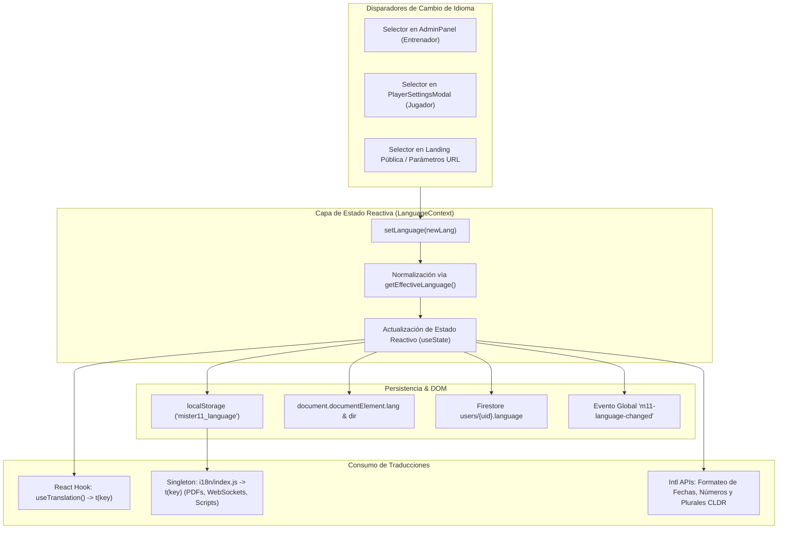

# INFORME TÉCNICO: ARQUITECTURA DEL SISTEMA DE INTERNACIONALIZACIÓN (i18n) Y CAMBIO DE IDIOMA EN MÍSTER11

**Versión:** 1.1.77 (Build 95)  
**Fecha:** 10 de Octubre de 2026  
**Área:** Arquitectura Frontend, React Hooks, Protocolo Multi-Lengua e Integración Cloud/Mobile  

---

## 1. Resumen Ejecutivo

El sistema de cambio de idioma de **Míster11** opera bajo una arquitectura reactiva desacoplada, multi-nivel y sin recarga de página (*Zero-Reload Hot Swapping*). Permite alternar instantáneamente la interfaz entre **6 idiomas oficiales Tier 1**:
1. 🇪🇸 **Español (ES)** — `es` / `es-ES` (Idioma base por defecto)
2. 🌎 **Español (Latinoamérica)** — `es-419` / `es-419`
3. 🇬🇧 **English (EN)** — `en` / `en-GB`
4. 🇧🇷 **Português (Brasil)** — `pt` / `pt-BR`
5. 🇫🇷 **Français (FR)** — `fr` / `fr-FR`
6. 🇮🇩 **Bahasa Indonesia (ID)** — `id` / `id-ID`

El sistema garantiza:
- **Separación de Carriles de Contenido:** Distinción estricta entre UI del sistema (Carril A), contenido clínico/federativo (Carril B) y contenido libre del autor/entrenador (Carril C).
- **Paridad Simétrica al 100%:** 2.655 claves idénticas auditadas en todos los diccionarios.
- **Doble Capa de Consumo:** Soporte para componentes React mediante el hook reactivo `useTranslation()` y soporte singleton agnóstico para contextos sin React (generación de PDFs con `jsPDF`, Web Workers, scripts y tests).
- **Persistencia Tripartita:** Memoria local reactiva, `localStorage` en el navegador/dispositivo y sincronización remota en Firestore (`users/{uid}`).



---

## 2. Los Tres Carriles de Contenido

Para evitar traducciones forzadas o corrupciones en los datos deportivos y médicos, el sistema implementa la **Separación en Tres Carriles**:

| Carril | Descripción | Tratamiento Lingüístico | Ejemplo |
| :--- | :--- | :--- | :--- |
| **Carril A (UI)** | Botones, menús, etiquetas, formularios, alertas y cabeceras de tablas. | 100% traducido desde los diccionarios de `src/i18n/locales/`. | `"GUARDAR PLANIFICACIÓN"`, `"MESES"`, `"TESTE FÍSICO"` |
| **Carril B (Clínico)** | Protocolos de prevención de lesiones (FIFA 11+, F-MARC) y evaluaciones médicas. | Vinculado a documentación oficial federativa en `registry.js` con trazabilidad de origen. Si no está certificado, opera con fallback transparente. | Criterios del test Yo-Yo, escalas de esfuerzo Borg. |
| **Carril C (Autor)** | Ejercicios tácticos creados por el míster, nombres de jugadores, equipos y notas libres. | Se preserva en el idioma original redactado por el autor sin traducción automática destructiva. | Nombre del ejercicio: *"Rondo 4x4 + 3 comodines"*. |

---

## 3. Arquitectura del Código Fuente

### 3.1. Estructura de Directorios

```text
src/
├── i18n/
│   ├── index.js                  # Singleton universal para consumo fuera de React (PDFs, scripts)
│   ├── translations.js           # Orquestador, normalizador y motor de fallback en cascada
│   └── locales/
│       ├── registry.js           # Registro de metadatos BCP47, estados federativos y fuentes oficiales
│       ├── index.js              # Exportación empaquetada de diccionarios
│       ├── es.js                 # Diccionario Español (España) - 2.655 claves
│       ├── es-419.js             # Diccionario Español (Latinoamérica) - 2.655 claves
│       ├── en.js                 # Diccionario Inglés - 2.655 claves
│       ├── pt.js                 # Diccionario Portugués (Brasil) - 2.655 claves
│       ├── fr.js                 # Diccionario Francés - 2.655 claves
│       └── id.js                 # Diccionario Bahasa Indonesia - 2.655 claves
├── context/
│   └── LanguageContext.jsx       # Contexto React con sincronización en caliente, Firestore y DOM
└── hooks/
    └── useTranslation.js         # Hook ergonómico consumido por todas las páginas y componentes
```

---

## 4. Funcionamiento Paso a Paso con Código Real

### Paso 1: Normalización de Códigos de Idioma (`src/i18n/translations.js`)
El sistema acepta tanto nombres descriptivos (`"Português (Brasil)"`), códigos BCP47 (`"pt-BR"`, `"pt"`), como variaciones en minúsculas. Todo se normaliza de manera infalible:

```javascript
// src/i18n/translations.js
export const getEffectiveLanguage = (input) => {
  if (typeof input === 'string') {
    const trimmed = input.trim();
    if (trimmed === 'English (EN)' || trimmed === 'en' || trimmed.toLowerCase().startsWith('en')) {
      return 'English (EN)';
    }
    if (trimmed === 'Español (Latinoamérica)' || trimmed === 'es-419' || trimmed === 'es-LA') {
      return 'Español (Latinoamérica)';
    }
    if (trimmed === 'Português (Brasil)' || trimmed === 'pt-BR' || trimmed === 'pt' || trimmed.toLowerCase().startsWith('pt')) {
      return 'Português (Brasil)';
    }
    if (trimmed === 'Français (FR)' || trimmed === 'fr-FR' || trimmed === 'fr' || trimmed.toLowerCase().startsWith('fr')) {
      return 'Français (FR)';
    }
    if (trimmed === 'Bahasa Indonesia (ID)' || trimmed === 'id-ID' || trimmed === 'id' || trimmed.toLowerCase().startsWith('id')) {
      return 'Bahasa Indonesia (ID)';
    }
    if (trimmed === 'Español (ES)' || trimmed === 'es' || trimmed.toLowerCase().startsWith('es')) {
      return 'Español (ES)';
    }
  }

  // Si no se especifica, lee localStorage
  try {
    const saved = localStorage.getItem('mister11_language') || localStorage.getItem('language');
    if (saved) return getEffectiveLanguage(saved);
  } catch (_) {}

  // Por defecto en Míster11 es siempre Español (ES)
  return 'Español (ES)';
};
```

---

### Paso 2: Motor de Resolución y Fallback en Cascada (`src/i18n/translations.js`)
Cuando se solicita una clave mediante `t(key, replacements, fallback)`:
1. Se consulta el diccionario activo.
2. Si la clave no existe (`undefined`), se busca en **Inglés (EN)** y luego en **Español (ES)** como salvaguarda.
3. Se realiza la interpolación segura de parámetros con sintaxis `{variable}`.

```javascript
// src/i18n/translations.js
export const t = (key, language, replacements = {}, fallback = null) => {
  const effLang = getEffectiveLanguage(language);
  const targetDict = translations[effLang] || translations['Español (ES)'];
  let text = targetDict?.[key];

  // Fallback en cascada
  if (text === undefined) {
    if (typeof window !== 'undefined' && window.dispatchEvent) {
      window.dispatchEvent(new CustomEvent('m11-i18n-missing-key', { detail: { key, lang: effLang } }));
    }
    text = translations['English (EN)']?.[key] || translations['Español (ES)']?.[key] || fallback || key;
  }
  
  // Interpolación de variables
  if (typeof text === 'string') {
    Object.keys(replacements).forEach(r => {
      text = text.replace(new RegExp(`\\{${r}\\}`, 'g'), replacements[r]);
    });
  }
  
  return text;
};
```

---

### Paso 3: Reactividad y Sincronización en Caliente (`src/context/LanguageContext.jsx`)
`LanguageProvider` almacena el estado global y propaga los cambios inmediatamente a toda la aplicación:

```javascript
// src/context/LanguageContext.jsx
export const LanguageProvider = ({ children }) => {
  const { user } = useAuth() || {};

  const [language, setLanguageState] = useState(() => {
    try {
      const saved = localStorage.getItem('mister11_language') || localStorage.getItem('language');
      if (saved) return getEffectiveLanguage(saved);
    } catch (_) {}
    return getEffectiveLanguage();
  });

  const setLanguage = useCallback((newLang) => {
    const effLang = getEffectiveLanguage(newLang);
    setLanguageState(effLang);
    const meta = getLocaleMetadata(effLang);

    // 1. Persistencia local inmediata
    try {
      localStorage.setItem('mister11_language', effLang);
      localStorage.setItem('language', effLang);
      window.dispatchEvent(new CustomEvent('m11-language-changed', { detail: effLang }));
      
      // 2. Actualización de atributos DOM (accesibilidad y SEO)
      if (typeof document !== 'undefined' && document.documentElement) {
        document.documentElement.lang = meta.code;
        document.documentElement.dir = meta.dir || 'ltr';
      }
    } catch (_) {}

    // 3. Persistencia en la nube (Firestore) para el usuario autenticado
    if (user?.uid && user.uid !== 'invitado-local') {
      try {
        const userRef = doc(db, 'users', user.uid);
        updateDoc(userRef, { language: effLang }).catch(() => {});
      } catch (_) {}
    }
  }, [user?.uid]);

  const t = useCallback((key, replacements, fallback) => {
    return tFunction(key, language, replacements, fallback);
  }, [language]);

  return (
    <LanguageContext.Provider value={{ language, setLanguage, t, isEn: language === 'English (EN)' }}>
      {children}
    </LanguageContext.Provider>
  );
};
```

---

### Paso 4: Consumo Ergonómico en Componentes (`src/hooks/useTranslation.js`)
Cualquier vista o componente React consume las traducciones de forma concisa y declarativa:

```javascript
// src/hooks/useTranslation.js
import { useLanguage } from '../context/LanguageContext';

export const useTranslation = () => {
  const { t, language, isEn, locale, setLanguage, formatDate, formatNumber, fmtPlural, getWeekdays } = useLanguage();
  return { t, language, isEn, locale, setLanguage, formatDate, formatNumber, fmtPlural, getWeekdays };
};
```

**Ejemplo de uso en un componente:**
```jsx
import React from 'react';
import { useTranslation } from '../hooks/useTranslation';

const PlanHeader = () => {
  const { t } = useTranslation();

  return (
    <div>
      <h1>{t('planning.matrix.title')}</h1>
      <span>{t('plan.reschedule.body', { day: 'Sábado', count: 3 })}</span>
    </div>
  );
};
```

---

### Paso 5: Consumo Fuera de React (PDFs y Exportaciones con `src/i18n/index.js`)
Para módulos como el generador de informes en PDF ([pdfGenerator.js](file:///c:/Users/jhojan/Desktop/MISTER%2011/mister11-web/src/utils/pdfGenerator.js)), donde no se pueden utilizar React Hooks:

```javascript
// src/i18n/index.js
import { t as tFunction, getEffectiveLanguage } from './translations.js';

export function getLanguage() {
  const saved = localStorage.getItem('mister11_language');
  return getEffectiveLanguage(saved);
}

export function t(key, replacements = {}, fallback = null) {
  return tFunction(key, getLanguage(), replacements, fallback);
}

// Uso directo en cualquier función utilitaria:
// import { t } from '../i18n';
// doc.text(t('pdf.report.title'), 10, 10);
```

---

### Paso 6: Formateo Nativo con APIs Internacionales (Intl)
El sistema no utiliza librerías pesadas externas para fechas o monedas; emplea las APIs estándar del motor JavaScript (`Intl`), asegurando un bundle ligero y máximo rendimiento:

1. **Fechas (`formatDate`):** Aplica automáticamente el formato cultural correcto (`DD/MM/YYYY`, `MM/DD/YYYY`, nombres de meses adaptados).
2. **Números (`formatNumber`):** Emplea las convenciones locales de puntos y comas decimales.
3. **Plurales CLDR (`fmtPlural`):** Soporta reglas complejas de pluralización según las especificaciones del Consorcio Unicode (`one`, `other`, `few`, `many`).

---

## 5. Garantía de Calidad y Pipeline de CI (`scripts/ci-i18n-gate.mjs`)

Para prevenir que se rompa el sistema en el futuro, se ejecuta en cada build el pipeline de validación estricta con `npm run i18n:ci`:

```text
══════════════════════════════════════════════════════════════════════
🚀 [CI-I18N-GATE] VALIDACIÓN ESTRICTA DEL PROTOCOLO MULTI-LENGUA
══════════════════════════════════════════════════════════════════════
▶ [Gate 1/7] Paridad simétrica de claves en todas las lenguas activas... ✅ 100% (2.655 claves/idioma)
▶ [Gate 2/7] Integridad lingüística, enums y reglas CLDR PluralRules... ✅ Válido
▶ [Gate 3/7] Detector por cadena (mezclas lingüísticas y tokens cruzados)... ✅ 0 mezclas rotas
▶ [Gate 4/7] Auditoría de ausencia total de literales estáticos UI... ✅ 0 offenders
▶ [Gate 5/7] Interpolación correcta de variables {placeholder}... ✅ 100% verificado
▶ [Gate 6/7] Aislamiento de lenguas activas vs pendientes... ✅ 6 activas, 5 pendientes
▶ [Gate 7/7] Breakage Test (Prueba de rotura simulada)... ✅ CI bloquea claves huérfanas
══════════════════════════════════════════════════════════════════════
🎉 ¡TODOS LOS GATES MULTI-LENGUA APROBADOS CON ÉXITO! (7/7)
```

---

## 6. Buenas Prácticas y Regla Contra Shadowing de Variables

> [!CAUTION]
> **Regla de Desarrollo Obligatoria:**  
> Al importar `const { t } = useTranslation();`, **NUNCA** se debe nombrar una variable de iteración en bucles o funciones como `t` (por ejemplo: `teams.map(t => ...)` o `tests.map(t => ...)`).  
> **Causa:** Esto sombrea (*shadowing*) la función global de traducción e invoca el objeto iterado en lugar de la función, provocando la excepción `TypeError: t is not a function`.  
> **Convención:** Utilizar nombres explícitos como `teamItem`, `testItem`, `playerItem`, `microItem`.
