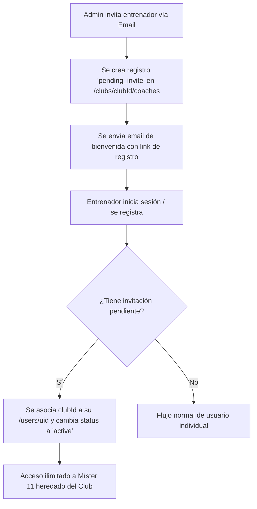

# Plan de Implementación: Modo Club (Míster 11)

Este documento detalla la estrategia técnica, la arquitectura de base de datos y el plan de desarrollo para implementar el **Plan CLUB** en la plataforma **Míster 11**.

---

## 🏛️ 1. Arquitectura de Datos (Firestore)

Para permitir que varios entrenadores accedan, editen y compartan datos dentro de una misma entidad (Club) de forma segura, se estructurará una colección raíz `/clubs`.

### 📂 Estructura de la Colección `/clubs`

Cada club se creará tras la activación de una suscripción de Stripe de nivel Club.

#### `/clubs/{clubId}`
```json
{
  "name": "Mister11 FC",
  "ownerId": "UID_PROPIETARIO", // Quien paga la suscripción
  "createdAt": "2026-06-11T18:00:00Z",
  "subscriptionId": "sub_123456",
  "stripePriceId": "price_1Tg6Sg...",
  "coaches": [
    {
      "email": "owner@mister11.app",
      "uid": "UID_PROPIETARIO",
      "role": "owner",
      "status": "active"
    },
    {
      "email": "entrenador2@mister11.app",
      "uid": "UID_INVITADO_1",
      "role": "coach",
      "status": "active"
    },
    {
      "email": "entrenador3@mister11.app",
      "uid": null, // Nulo hasta que el invitado acepte la invitación
      "role": "coach",
      "status": "pending_invite"
    }
  ]
}
```

### 📂 Modificación de la Colección `/users/{uid}`

Para vincular de forma inmediata a los usuarios a sus respectivos clubes y autorizar sus permisos:
```json
{
  "displayName": "Nombre Entrenador",
  "email": "entrenador2@mister11.app",
  "clubId": "ID_DEL_CLUB", // Si es null, opera como usuario individual (PRO/FREE)
  "clubRole": "coach" // 'owner' o 'coach'
}
```

### 📂 Gestión de Equipos (`/teams`)

En el flujo individual, los equipos son subcolecciones de usuarios (`/users/{uid}/teams/{teamId}`).
En el **Modo Club**, los equipos se migrarán a una estructura compartida:
- `/clubs/{clubId}/teams/{teamId}`
- *Nota:* Los entrenadores del club podrán visualizar o editar los equipos asignados por el administrador, garantizando la centralización de los datos.

---

## 👥 2. Flujo de Licencias Multi-Entrenador

El sistema permitirá al administrador (Owner) invitar a otros profesionales utilizando sus correos electrónicos:



---

## 🏅 3. Panel Administrativo del Club (Ajustes -> Mi Club)

Se implementará una pestaña exclusiva en el **Panel de Administración** visible únicamente para cuentas asociadas a un club.

### Características del Panel:
1. **Gestión de Entrenadores:**
   - Lista de entrenadores vinculados y estados (Activo / Invitación Pendiente).
   - Input con botón de acción (mínimo 48x48 dp) para invitar a nuevos entrenadores por correo.
   - Botón para revocar acceso (eliminar licencia).
2. **Asignación de Equipos:**
   - Visualización de todos los equipos del club.
   - Selector dinámico para asignar/reasignar entrenadores a equipos específicos.
3. **Control de Facturación (Solo para el Owner):**
   - Integración con el Portal de Clientes de Stripe para gestionar la suscripción mensual del club (39.99€/mes).

---

## 📈 4. Informes Consolidados del Club

Vista analítica para directores deportivos u Owners que consolida la información de todos los equipos:

* **Métricas Clave:**
  - Volumen total de sesiones creadas e impartidas en el club.
  - Gráfico de asistencia global por categorías (Alevín, Infantil, Cadete, etc.).
  - Rendimiento general y promedios en test físicos del club.
* **Exportación en PDF:**
  - Generador de informe global del club consolidado para presentación a juntas directivas.

---

## 🛠️ 5. Fases de Desarrollo Propuestas

### Fase 1: Límites y Estructura Base (Firebase)
* Habilitar límites ilimitados en `usePlan.js` para cuentas `club`.
* Crear colección raíz `/clubs` en Firestore y vincularla al flujo de webhook de Stripe.

### Fase 2: Módulo de Invitación e Integración Multi-Entrenador
* Programar flujo de invitaciones en Firestore y triggers de vinculación de cuentas.
* Actualizar reglas de seguridad `firestore.rules` para validar membresía del club.

### Fase 3: Interfaz de Gestión (Panel Administrativo)
* Diseñar y programar la pestaña "Mi Club" en `AdminPanel.jsx` con diseño responsivo Android-first.
* Permitir asignar entrenadores a los equipos del club.

### Fase 4: Estadísticas Consolidadas y Reportes
* Crear los paneles de gráficos agregados y exportación a PDF de rendimiento del club.
